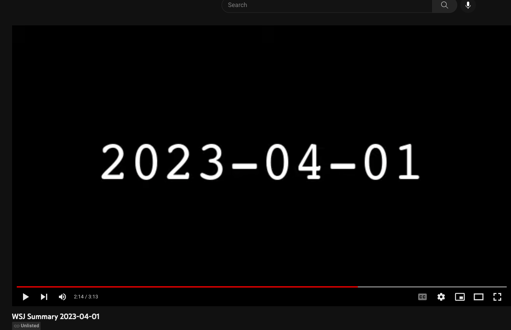
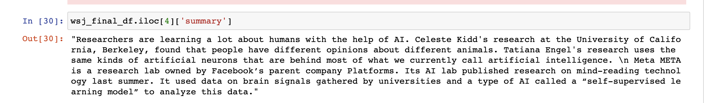

# News Summarizer

The script fetches today's WSJ newspaper (https://www.wsj.com/news/archive/2023/04/01) using selenium and extracts the articles. It then uses the bart-large-cnn-samsum model to summarize each article (https://huggingface.co/philschmid/bart-large-cnn-samsum). It then generates audio & video out of the summaries using gTTS and moviepy. We then upload the video to youtube by using the youtube API.

Screenshot of the video uploaded on youtube: 

Example Summary for https://www.wsj.com/articles/artificial-intelligence-is-teaching-us-new-surprising-things-about-the-human-mind-ba7cdceb:

